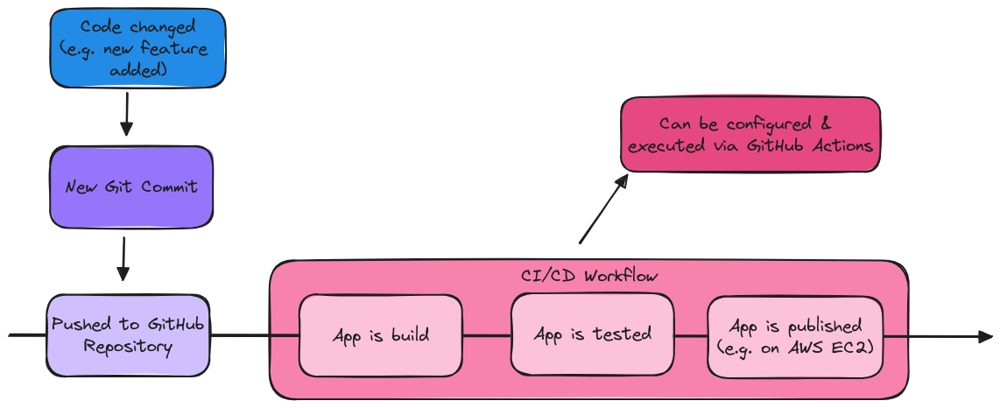

# GitHub Actions - The Complete Guide

Learn how to build automated CI/CD workflows with GitHub's DevOps service. 🛠️🔄

**About this Repository** 
🌐 Dive into [GitHub Actions](https://github.com/features/actions) with this _[Complete Guide](https://www.udemy.com/course/github-actions-the-complete-guide/)_. 
🔄 Automate both code- & and project-based task and run workflows triggered by a wide variety of events. 
💻 Develop powerful CI/CD workflows that include runtime configuration, security, and conditional execution. 
🔒 Discover best practices for securing _GitHub Action_ workflows. 
🛠️ Create custom actions or utilize public community solutions. 
🚀 Dive into developing, deploying, and scaling applications with efficient automation!

## GitHub Actions & CI/CD

GitHub Actions is a _Workflow Automation_ service offered by GitHub. It Automates all kinds of repository-related processes and actions.

- Code Deployment (CI/CD) - Automate code testing, building & deployment
- Code & Repository Management - Automate code reviews, issue management etc.

**What's CI/ CD** 
CI/CD are methods for automating app development and deployment

- Continuous Integration - Code changes are automatically built, tested & merged with existing code
- Continuous Delivery - After integration, new app or package versions are published automatically

