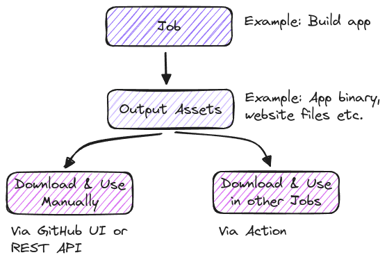
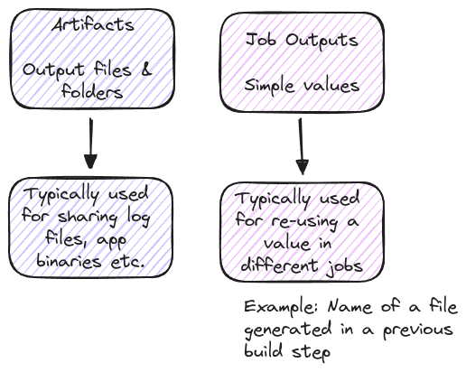
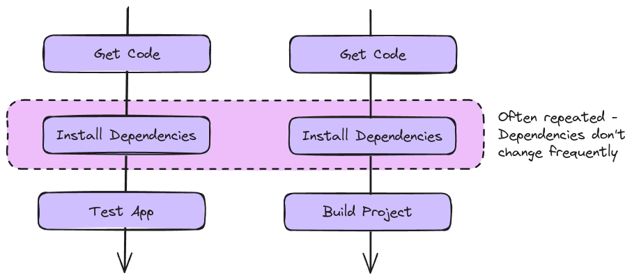

# Jobs Artifacts & Outputs

**Job Artifacts & Outputs** are important for effectively managing and utilizing job-related data in any workflow. Working with artifacts ensures that valuable data is preserved and accessible throughout the workflow process, enabling seamless transitions between different stages. Managing job outputs efficiently allows for clear tracking and utilization of results, ensuring that each step in the process contributes to the final goal. Caching dependencies enhances performance by reusing previously fetched data, minimizing redundant operations, and speeding up the overall workflow.

## Understanding Job Artifacts

## Understanding Job Outputs

## Caching Dependencies

