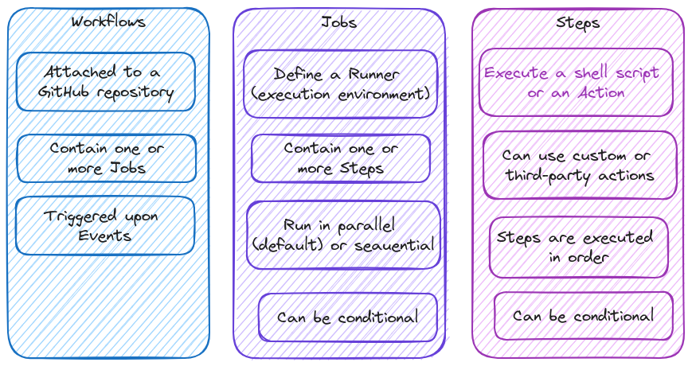

# GitHub Actions - Basic Building Blocks & Components

**Understanding the Key Elements** is essential for mastering workflows. Working with workflows, jobs, and steps provides a clear picture of how everything fits together. Finally, building an example workflow brings all these concepts into practice, demonstrating how they come to life in a real-world scenario.

## Key Components

**Events (Workflow Triggers)** 
All possible event can be found in the [official docs](https://docs.github.com/en/actions/writing-workflows/choosing-when-your-workflow-runs/events-that-trigger-workflows).
