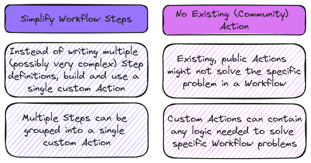

# Building & Using Custom Actions

**Beyond Shell Commands and the Marketplace** - Understanding and creating custom GitHub Actions is essential for building more powerful and tailored workflows. By going beyond pre-built actions and basic shell commands, you can design custom actions that meet your specific needs. Learn about the different types of custom actions, why they matter, and how to build and use them effectively in your projects.

## Custom Actions

### Why Custom Actions?

### Different Types

| JavaScript Actions                               | Docker Actions                                      | Composite Actions                                      |
| ------------------------------------------------ | --------------------------------------------------- | ------------------------------------------------------ |
| Execute a JavaScript file                        | Create a Dockerfile with the required configuration | Combine multiple Workflow Steps in one single Action   |
| Use JavaScript (NodeJS) + any packages needed    | Perform any task(s) with any language               | Combine run (commands) and uses (Actions)              |
| Pretty straightforward (when knowing JavaScript) | Lots of flexibility but requires Docker knowledge   | Allows for reusing shared Steps (without extra skills) |
