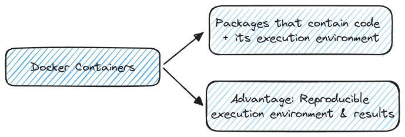
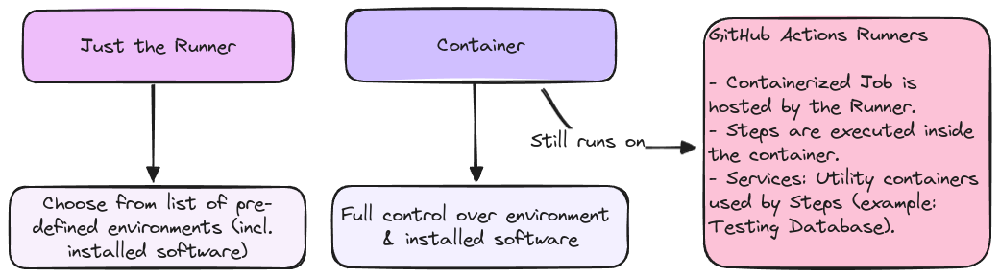

# Jobs & Docker Containers

**Utilizing Docker Containers** within GitHub Actions provides enhanced flexibility by enabling jobs to run directly inside containers, rather than being limited to the runner machine. Connect seamlessly to databases, web services and more using Service Containers, opening up a range of possibilities for more complex and integrated workflows.

## What are Containers?

### Why use Containers

