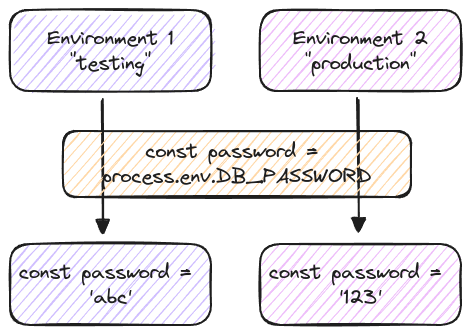

# Environment Variables & Secrets

**Hardcoding Is Not (Often) The Solution** and flexibility is key in GitHub Actions. It's crucial not only to understand the need for environment variables but also to implement them correctly. In addition to environment variables, GitHub Actions provides two other essential concepts: _Secrets_ and _Job Environments_.

## Environment Variables

Certain environment variable values, such as a database access password, should never be exposed. To safeguard this information, use Secrets in conjunction with environment variables.
