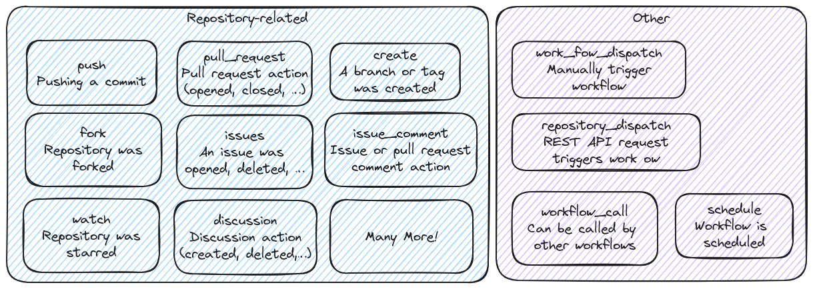
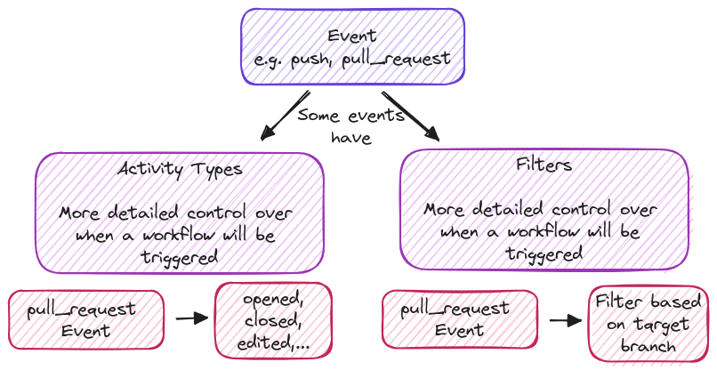

# Workflow & Events - Deep Dive

**Diving Deeper Into Workflow Triggers** offers control on how and when workflows run. Utilizing event filters refines workflow execution, allowing specific triggers to dictate when workflows should run. Detailed control is further achieved through activity types, which tailor the response to particular events. Examples illustrate how these advanced features come together, showcasing their practical application in workflow management.

## Available Events

All possible event can be found in the [official docs](https://docs.github.com/en/actions/writing-workflows/choosing-when-your-workflow-runs/events-that-trigger-workflows).

## Activity Types & Filters

## Quick Notes about Events

### Fork Pull Request Workflows

By default, Pull Requests based on Forks do NOT trigger a workflow Reason: Everyone can fork & open pull requests. Malicious workflow runs & excess cost could be caused. This is why First-time contributors must be approved manually.

### Cancelling & Skipping

**Cancelling:** By default, workflows get cancelled if a Job fails. A Job fails if at least one Step fails. A workflow can be cancelled manually. 
**Skipping:** By default, all matching events start a workflow, but there are exceptions for "_push_" and "_pull_request_". Skip can be done with a proper commit message.
