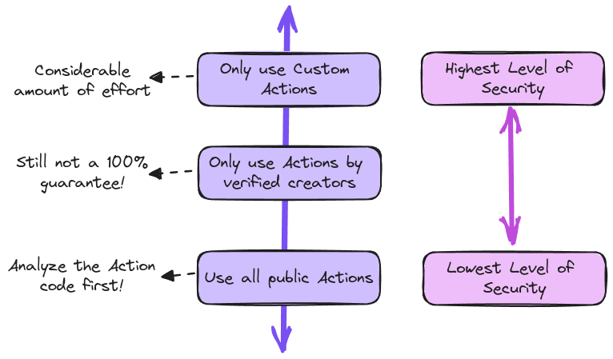
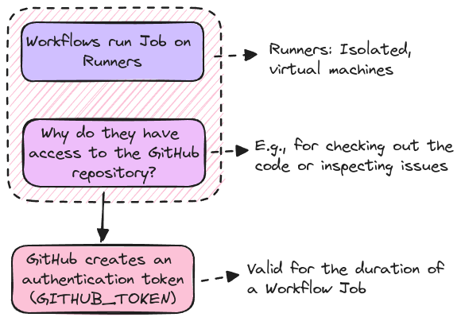

# Security & Permissions

**Keep Things Secure** by safeguarding workflows is essential for maintaining project integrity. This includes following best practices for securing workflows, managing GitHub tokens and permissions effectively, and understanding the risks associated with granting third-party permissions. Protecting code and data at every step reduces the likelihood of unauthorized access and potential vulnerabilities.

## Security Concerns

| Script Injection                                        | Malicious Third-Party Actions                                            | Permission Issues                                      |
| ------------------------------------------------------- | ------------------------------------------------------------------------ | ------------------------------------------------------ |
| A value, set outside a Workflow, is used in a Workflow  | Actions can perform any logic, including potentially malicious logic     | Consider avoiding overly permissive permissions        |
| _Example:_ Issue title used in a Workflow shell command | _Example:_ A third-party Action that reads and exports secrets           | _Example:_ Only allow checking out code (“read-only”)  |
| Workflow / command behavior could be changed            | Only use trusted Actions and inspect code of unknown / untrusted authors | GitHub Actions supports fine-grained permissions contr |

### Using Actions Securely

### GitHub Permissions

## Example - AWS Permission

To learn how to implement _OpenID Connect_ for authentication within an GitHub workflow, the [official documentation](https://docs.github.com/en/actions/security-for-github-actions/security-hardening-your-deployments/configuring-openid-connect-in-amazon-web-services) provides detailed guidance. This resource covers the integration of _OpenID Connect_ as part of the authentication process in AWS environments. 
It is important to recognize that _OpenID Connect_ is a versatile authentication protocol and is not limited to AWS. It can also be utilized with other cloud providers, such as Google Cloud and Microsoft Azure.
