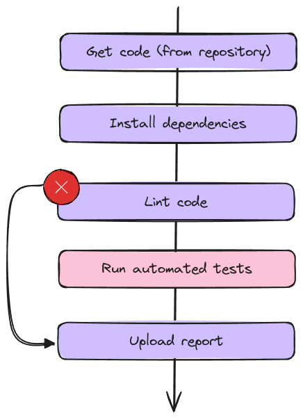
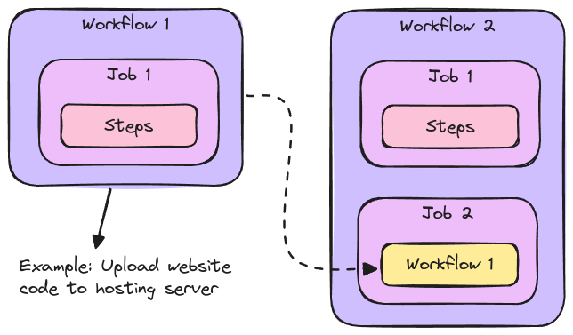

# Controlling Workflow & Job Execution

**Controlling Execution Flow** goes beyond step-by-step flows Running jobs and steps conditionally provides greater flexibility by allowing or skipping parts of the workflow based on specific conditions. Using a Matrix to run jobs across multiple configurations, environments, or scenarios simultaneously maximizes efficiency and coverage. Additionally, reusing workflows streamlines processes, reducing redundancy and maintaining consistency.

## Controlling Execution Flow

- Jobs: Conditional execution via _if_-field
- Steps: Conditional execution via _if_-field, ignore errors via _continue-on-error_ field

Conditions need to be evaluated via _Expressions_.

### Special Conditional Function

- **failure():** Returns true when any previous Step or Job failed
- **success():** Returns true when none of the previous steps have failed
- **always():** Causes the step to always execute, even when cancelled
- **cancelled():** Returns true if the work ow has been cancelled

## Reusable Workflows

